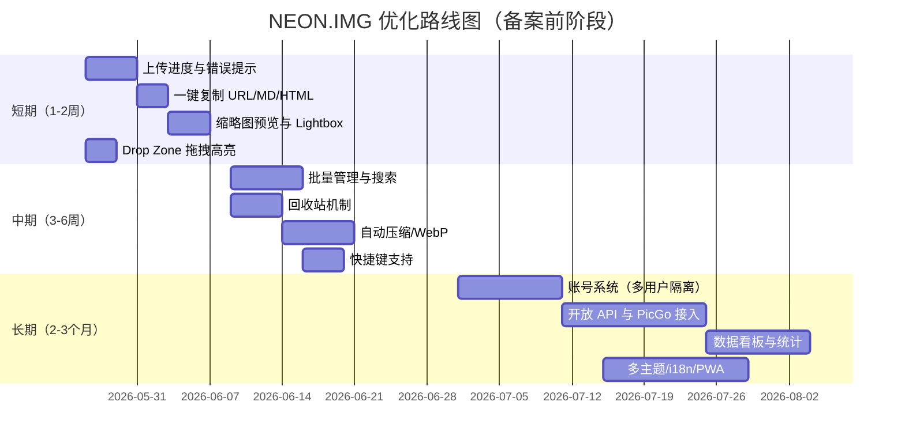

# NEON.IMG v1.0 产品优化建议文档

> **文档版本**：v1.2
> **撰写日期**：2026-05-26
> **更新日期**：2026-05-26（新增账号系统设计）
> **评估对象**：NEON.IMG 图片托管/管理应用
> **核心结论**：NEON.IMG 当前处于"风格强、功能薄"的阶段，赛博朋克的视觉表达已经做出了差异化。在备案完成前，应优先打磨 **上传反馈、链接一键复制、图库管理、视觉细节** 这四类纯前端/产品体验优化，让产品在内测期就具备良好可用性。

---

## 一、产品现状解析

### 1.1 产品定位

NEON.IMG 是一款主打 **赛博朋克 / 终端命令行（Terminal CLI）** 美学的极简图片托管应用，版本号 v1.0，署名 "Powered by Night City"，明显借鉴了《赛博朋克 2077》的视觉语言。

### 1.2 视觉特征

- 标题装饰符号：`◤ NEON.IMG ◢`、`⌬`、`▼`、`>>`
- 伪代码注释语法：`DROP_FILE_HERE.exe_`、`// PASTE // CLICK // DRAG`
- 中英混排文案：刻意将"删除文件"表达为"销毁数据包"，强化沉浸感

### 1.3 功能模块

| 模块                                  | 说明                                                  |
| ------------------------------------- | ----------------------------------------------------- |
| 数据上传接口（DATA UPLINK INTERFACE） | 支持 **粘贴 / 点击 / 拖拽** 三种方式，单文件上限 10MB |
| 图库检索（GALLERY）                   | 当前显示 1 条数据（#001.PNG，7.00 MB）                |
| 链接生成                              | 提供 `URL / MD / HTML` 三种引用格式                   |
| 删除确认                              | 二次确认弹窗："即将永久销毁该数据包，确认继续？"      |

---

## 二、优化方向

### 2.1 交互体验与功能完整性（P0 高优）

当前页面给出了上传入口和图库展示，但仍有不少基础体验缺口需要补齐。

#### 2.1.1 上传反馈机制

- 增加 **上传进度条**，对 7MB 级别的文件尤其重要
- 上传失败（超过 10MB、格式不支持、网络异常）时给出明确的错误提示，保持赛博风格文案，例如：`// ERROR: PACKET CORRUPTED // SIZE EXCEEDED 10MB`
- 拖拽进入页面时，Drop Zone 应高亮变色（霓虹青/品红描边动画）
- 上传成功瞬间加入"数据包注入"动画反馈，强化沉浸感

#### 2.1.2 图库管理能力

- 支持 **批量选择 / 批量删除 / 批量复制链接**
- 增加 **搜索、排序（时间/大小/名称）、筛选（PNG/JPG/GIF/WebP）**
- 提供 **缩略图预览 + Lightbox 放大**
- 支持 **重命名** 与 **标签（Tag）** 分类
- 增加 **回收站机制**（保留 7~30 天），避免误删后无法恢复

#### 2.1.3 链接生成体验

- 点击 `URL / MD / HTML` 自动复制到剪贴板，并弹出 Toast 提示
- 支持生成 **多种尺寸的引用链接**（原图、缩略图、压缩版）
- 链接格式可记忆用户偏好，下次默认使用上次选择的格式

---

### 2.2 视觉与一致性（P1）

赛博朋克风格已经成型，但细节仍可继续打磨。

| 维度     | 当前状态             | 优化建议                                                     |
| -------- | -------------------- | ------------------------------------------------------------ |
| 配色     | 单色霓虹为主         | 引入 CP 双色对比（青 `#00FFF0` + 品红 `#FF2E88`），加入扫描线/CRT 滤镜 |
| 字体     | 等宽字体             | 标题改用 Orbitron / Rajdhani，正文保留 monospace             |
| 动效     | 静态为主             | 加入打字机效果、Glitch 故障动画、Neon Glow 辉光              |
| 中英混排 | 风格统一但字号不一致 | 统一中英文行高与字号                                         |
| 光标     | 默认指针             | 自定义霓虹光标，悬停按钮时切换为 `crosshair` 风格            |

---

### 2.3 功能扩展（P1）

让产品从"能用"走向"好用"，需要补充以下能力：

- **图片处理**：上传时自动压缩、转 WebP/AVIF、生成多分辨率版本；提供在线裁剪、加水印、马赛克
- **账户体系**：多用户系统，数据隔离，支持 JWT 会话登录 + API Token 双轨鉴权（详见第六章）
- **API 与开放能力**：REST API / 上传 Token，对接 PicGo、Typora、Obsidian 等外部工具
- **使用统计**：展示每张图的访问次数、流量消耗，提供数据看板
- **快捷键支持**：`Ctrl+V` 直接粘贴上传、`Delete` 删除选中、`Esc` 关闭弹窗，贴合极客用户习惯

---

### 2.4 性能与工程化（P2）

- **懒加载**：图库数据量增长后，使用虚拟列表 / 分页 / 无限滚动
- **本地缓存**：使用 IndexedDB 缓存缩略图与列表，二次打开秒开
- **响应式布局**：针对 ≤768px 屏宽优化拖拽区与按钮尺寸
- **可访问性（a11y）**：提供亮色主题切换，符合 WCAG AA 对比度
- **国际化（i18n）**：功能性文案抽离为 i18n 资源，便于推出英文版
- **PWA 支持**：可安装到桌面，作为独立应用使用

---

## 三、优先级路线图



> **备注**：HTTPS 部署、内容审核、限流防刷、隐私声明等合规项将在域名备案通过后单独立项推进。

---

## 四、关键指标（建议跟踪）

| 指标                     | 目标值 | 说明                       |
| ------------------------ | ------ | -------------------------- |
| 上传成功率               | ≥ 99%  | 反映上传链路稳定性         |
| 首次有效操作时长（TTFA） | ≤ 5s   | 从打开页面到完成首张图上传 |
| 链接复制成功率           | 100%   | URL/MD/HTML 一键复制       |
| 缩略图首屏加载           | ≤ 1s   | 反映图库浏览流畅度         |
| 误删恢复率               | ≥ 90%  | 回收站机制上线后           |
| 月活留存（M1）           | ≥ 30%  | 重度用户留存               |
| 注册转化率               | ≥ 60%  | 访问→完成注册的转化        |
| API Token 使用率         | ≥ 20%  | 衡量极客用户渗透           |

---

## 五、结语

NEON.IMG 在视觉差异化上已经迈出了第一步，赛博朋克的氛围感是它最稀缺的资产。在域名备案审核期，正好是打磨产品体验的窗口期：

1. **先顺手**：上传进度 + 一键复制 + 拖拽高亮，降低使用摩擦
2. **再好用**：批量管理 + 回收站 + 自动压缩，覆盖日常高频场景
3. **后留人**：账户体系 + 开放 API + 数据看板，沉淀重度用户

按此节奏推进，待备案通过、合规模块补齐之时，NEON.IMG 已是一款体验完整、生态可期的差异化图床产品。

---

## 六、账号系统设计（P1 详细方案）

> 本章为 §2.3 账户体系的完整技术规格，供开发直接参考。

### 6.1 设计目标

| 目标           | 说明                                                   |
| -------------- | ------------------------------------------------------ |
| 多用户数据隔离 | 每个账号只能查看/操作自己上传的图片                    |
| 双轨鉴权       | 浏览器前端用 JWT，外部工具（PicGo/Typora）用 API Token |
| 开放注册       | 任何人可自行注册账号                                   |
| 无数据库依赖   | 延续现有 JSON 文件存储，不引入新数据库                 |
| 限流防刷       | IP 级别限流，防止暴力枚举账号                          |

### 6.2 数据结构

#### server/data/users.json

```json
[
  {
    "id": "nanoid(10)",
    "username": "samurai",
    "passwordHash": "bcrypt hash（rounds=10）",
    "token": "nanoid(32)",
    "isAdmin": false,
    "createdAt": "2026-05-26T00:00:00.000Z"
  }
]
```

> `isAdmin`：注册时若 `username === process.env.ADMIN_USERNAME`，自动标记为 `true`。未配置 `ADMIN_USERNAME` 时无人是管理员。

#### server/data/images.json（新增 userId 字段）

```json
[
  {
    "id": "filename",
    "userId": "对应用户 id",
    "name": "原始文件名",
    "size": 102400,
    "url": "https://...",
    "thumbUrl": "https://..._thumb.webp",
    "uploadedAt": "ISO 时间"
  }
]
```

> 旧数据（无 userId 字段）前端不予展示，属于预期行为。

### 6.3 后端技术方案

#### 依赖安装

```bash
cd server
npm install bcryptjs@^2.4.3 jsonwebtoken@^9.0.0
```

> `bcryptjs` 为纯 JS 实现，无原生模块，Windows/Linux 均可使用。

#### 环境变量（.env 新增）

```env
JWT_SECRET=your_random_long_secret_here
ADMIN_USERNAME=your_username_here
# 移除原有的 UPLOAD_TOKEN
```

#### 新增工具文件：server/utils/userMeta.js

| 函数                           | 说明                                  |
| ------------------------------ | ------------------------------------- |
| `readUsers()`                  | 读取 users.json，不存在返回 []        |
| `writeUsers(list)`             | 写入 users.json                       |
| `findUserByUsername(username)` | 按用户名查找                          |
| `findUserById(id)`             | 按 ID 查找                            |
| `findUserByToken(token)`       | 按 API Token 查找（用于外部工具鉴权） |

#### 鉴权中间件重写：server/middleware/auth.js

```
verifyJWT
  ├── 读取 Authorization: Bearer <jwt>
  ├── jwt.verify(token, JWT_SECRET)
  ├── 成功：req.user = { id, username } → next()
  └── 失败：401 { code: 401, msg: '// SESSION EXPIRED // LOGIN AGAIN' }

verifyApiToken
  ├── 读取请求头 x-upload-token
  ├── findUserByToken(token)
  ├── 找到：req.user = { id, username } → next()
  └── 找不到：401 { code: 401, msg: '// AUTH FAILED // INVALID TOKEN' }

verifyAuth（双轨合并）
  ├── 先尝试 verifyJWT
  ├── 失败则尝试 verifyApiToken
  └── 两者均失败：401

verifyAdmin（管理员鉴权）
  ├── 先走 verifyJWT 验证登录
  ├── 再检查 req.user.isAdmin === true
  ├── 是管理员：next()
  └── 不是：403 { code: 403, msg: '// ACCESS DENIED // ADMIN ONLY' }

rateLimiter（保持不变）
  └── express-rate-limit，1 分钟 30 次，针对 IP

> verifyJWT / verifyApiToken / verifyAuth 均已改造为注入 `req.user = { id, username, isAdmin }`。
```

#### 新增路由：server/routes/auth.js

| 路由                    | 方法 | 鉴权      | 说明                                                         |
| ----------------------- | ---- | --------- | ------------------------------------------------------------ |
| `/api/auth/register`    | POST | 无        | 注册，username 3-20 字符（字母数字下划线），password ≥ 6 字符 |
| `/api/auth/login`       | POST | 无        | 登录，返回 JWT（7天有效） + apiToken + isAdmin               |
| `/api/auth/me`          | GET  | verifyJWT | 返回当前用户信息和 apiToken                                  |
| `/api/auth/reset-token` | POST | verifyJWT | 重新生成 API Token                                           |

#### 新增路由：server/routes/admin.js

| 路由                    | 方法   | 鉴权        | 说明                                                         |
| ----------------------- | ------ | ----------- | ------------------------------------------------------------ |
| `/api/admin/users`      | GET    | verifyAdmin | 返回所有用户列表（脱敏：不含 passwordHash 和 token）         |
| `/api/admin/users/:id`  | DELETE | verifyAdmin | 删除用户及其全部数据，不能删除自己、不能删除其他管理员       |

返回格式：`[{ id, username, isAdmin, createdAt, imageCount, trashCount }]`，其中 `imageCount` 和 `trashCount` 从 images.json / trash.json 实时统计。

#### 上传路由改造要点

- 所有写操作（上传/删除/恢复/清空）从 `verifyToken` 改为 `verifyAuth`
- 上传时 item 写入 `userId: req.user.id`
- GET `/api/list` 和 GET `/api/trash` 改为需要 `verifyJWT`，只返回 `userId === req.user.id` 的条目
- 删除/恢复/清空操作校验 `item.userId === req.user.id`，不匹配返回 403

### 6.4 前端方案

#### 登录/注册界面

未登录时全屏显示 `#authModal`，主界面隐藏。样式风格与整体赛博朋克一致：

```
◤ NEON.IMG ◢ // IDENTIFY YOURSELF

[ LOGIN ]  [ REGISTER ]          ← Tab 切换

// USERNAME ___________________
// ACCESS CODE ________________

          [ AUTHENTICATE ]

// ERROR: WRONG CREDENTIALS     ← 错误提示区
```

#### localStorage Key 规范

| Key                    | 内容              | 说明                       |
| ---------------------- | ----------------- | -------------------------- |
| `neon_img_jwt`         | JWT 字符串        | 浏览器会话凭证，7 天有效   |
| `neon_img_api_token`   | API Token         | 供展示和复制给外部工具使用 |
| `neon_img_username`    | 用户名            | 显示在 HUD 顶栏            |
| `neon_img_is_admin`    | "1"/"0"           | 是否为管理员               |
| `neon_img_last_format` | url/md/html       | 复制格式偏好（已有）       |
| `neon_img_sort`        | 排序模式（已有）  |                            |
| `neon_img_view`        | grid/list（已有） |                            |

#### HUD 顶栏变化

```
移除：⚙ Token 配置按钮
新增：// USER: <username>（点击展开用户面板）
新增：⏻ LOGOUT 按钮
新增（管理员）：⊛ 管理面板按钮（品红色，hover 品红发光）
```

#### 用户面板（点击用户名展开）

```
// USERNAME: samurai
// API TOKEN: xxxxxxxxxxxxxxxx   [ COPY ] [ RESET ]
```

API Token 用于 PicGo / Typora 等外部工具，通过 `x-upload-token` 请求头传递。

#### 鉴权请求规范

```javascript
// 浏览器前端（所有 fetch/XHR）
headers: { 'Authorization': `Bearer ${jwt}` }

// 外部工具（PicGo / curl 等）
headers: { 'x-upload-token': 'your_api_token' }
```

401 响应处理：清除所有登录态 localStorage → 自动显示登录页。

### 6.5 安全注意事项

| 项目      | 措施                                |
| --------- | ----------------------------------- |
| 密码存储  | bcrypt hash，rounds=10，明文不落库  |
| JWT 密钥  | 存于 .env，不提交 git，随机长字符串 |
| API Token | nanoid(32)，用户可随时重置          |
| 限流      | IP 级别，1 分钟 30 次，防暴力枚举   |
| 越权访问  | 写操作校验 userId，不匹配返回 403   |
| .env 保护 | 确认 .gitignore 包含 .env           |

### 6.6 与现有功能的兼容性

| 现有功能                | 兼容处理                                   |
| ----------------------- | ------------------------------------------ |
| 旧图片数据（无 userId） | 前端按 userId 过滤，旧数据不显示，无需迁移 |
| 回收站（trash.json）    | 新增 userId 字段，purge 时同时清理缩略图   |
| sharp 缩略图            | 无影响，处理逻辑在上传管线内               |
| 快捷键系统              | 无影响                                     |
| 搜索/排序/筛选          | 无影响，仍在前端内存操作                   |

---

### 6.7 管理员系统（P1 扩展）

> 在账号系统基础上新增管理员能力，用于用户管理和数据治理。

#### 注册自动识别

注册时自动比对 `username` 与 `.env` 中的 `ADMIN_USERNAME`：
- 匹配 → `isAdmin: true`
- 不匹配 / 未配置 `ADMIN_USERNAME` → `isAdmin: false`（安全默认值）

管理员权限无法通过注册以外的途径获取。

#### 管理员面板（#adminPanel）

仅 `isAdmin()` 为 true 的用户可见。通过 HUD 顶栏 `⊛` 按钮（品红 hover 发光）打开。

```
◤ ADMIN TERMINAL ◢ // USER MANAGEMENT        [ × CLOSE ]
// TOTAL USERS: N // TOTAL IMAGES: N //

samurai_a           CREATED: 2026-05-26 // IMGS: 12 // TRASH: 3    [ PURGE USER ]
ninja_b             CREATED: 2026-05-26 // IMGS: 0 // TRASH: 0     [ PURGE USER ]
admin  [ADMIN]      CREATED: 2026-05-26 // IMGS: 5 // TRASH: 1

// ADMIN: admin //
```

交互规则：
- 管理员自身不显示 `[ PURGE USER ]` 按钮
- 其他管理员不显示 `[ PURGE USER ]` 按钮（防止管理员互删）
- 删除前复用现有模态框二次确认：`! WARNING: PURGE USER`
- 删除操作：移除用户 → 移除其所有图片条目 → 删除对应原图/缩略图文件 → 移除其回收站条目

#### API 端点

| 方法 | 路径 | 说明 |
| --- | --- | --- |
| GET | `/api/admin/users` | 用户列表（脱敏），管理员 only |
| DELETE | `/api/admin/users/:id` | 删除用户，不能删自己/其他管理员 |

#### 前端函数

| 函数 | 说明 |
| --- | --- |
| `isAdmin()` | 读取 `neon_img_is_admin`，返回 boolean |
| `buildAdminPanel()` | 创建管理员面板 DOM |
| `toggleAdminPanel()` | 显隐切换，打开时自动 `loadAdminPanel()` |
| `loadAdminPanel()` | GET `/api/admin/users`，渲染列表和统计 |
| `renderAdminUserList(users)` | 渲染用户行（管理员标签、删除按钮控制） |
| `askPurgeUser(id, username)` | 触发二次确认弹窗 |

#### CSS 要点

- `#adminPanel`：z-index 600，全屏 `rgba(10,14,26,.97)` 背景
- `.admin-box`：品红 `var(--neon-magenta)` 边框/辉光，区别于普通面板的青色
- `.admin-btn`：hover 品红发光，区别于普通按钮青色
- 管理员标签 `.admin-tag`：品红描边，字号 10px
- Escape 键可按 z-index 顺序依次关闭：authModal → userPanel → adminPanel → 删除确认 → 快捷键面板

---

*— END OF TRANSMISSION //*